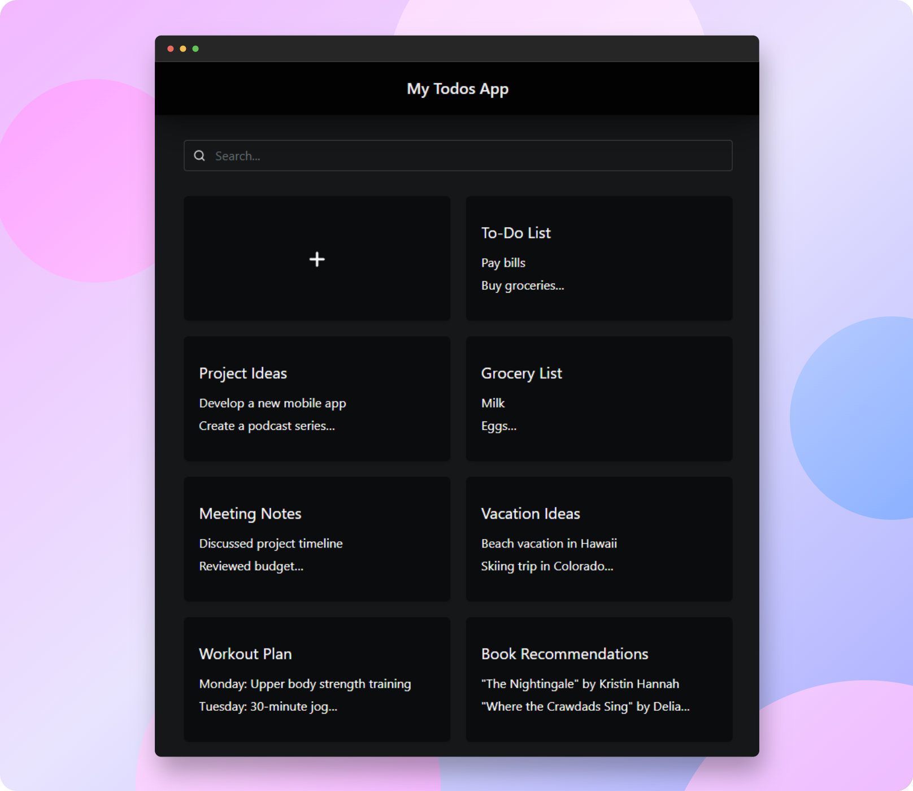

# Todos App

Super simple Todo (or notes) App built using SolidJS & Go Echo.

<div style="text-align: center; margin: 20px 0;">
    
</div>

## Stacks

### Frontend

- [SolidJS](https://www.solidjs.com/)
- [Hope UI](https://hope-ui.com/)
- Typescript

### Backend

- [Echo](https://echo.labstack.com/)
- [Gorm](https://gorm.io/) + SQLite3

## Project Structure

The project is structured as follows:

```css
client/
├── src/
│   ├── assets/
│   ├── services/
│   ├── types/
│   └── utils/
├── App.tsx
├── index.tsx
└── Todos.tsx

server/
├── models/
├── router/
├── services/
├── storage/
└── utils/

thunder-tests/
```

- `client`: base directory of frontend app.
- `server`: contains backend source code.
- `thunder-tests`: thunder client (vscode plugins) data to test rest api.

## Development

### Backend

- [Download & install](https://go.dev/doc/install) go
- `cd server && go run .`

### Frontend

- [Download & install](https://nodejs.org/en) node (v18)
- `cd client`
- `npm install`
- `npm run dev`
